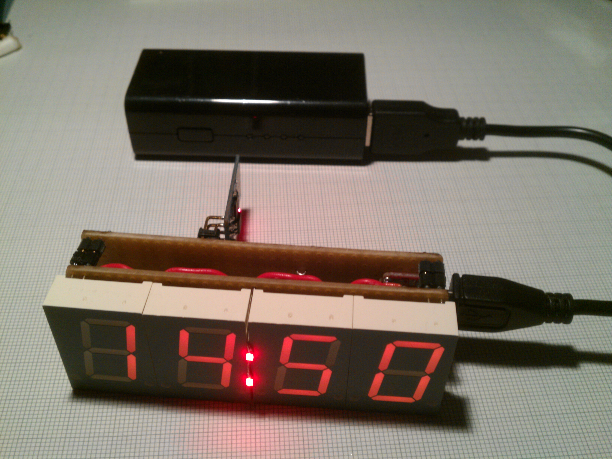

Clock made out of seven segment displays and shift registers I had lying around and an ESP-8266 01 as time source.

Inspiration for this project: https://hackaday.io/project/6568-tiny7

Requires getTime, sevenSeg and shiftOut libraries from [**my libraries repo**](https://github.com/stefan-lochbrunner/LUA).

